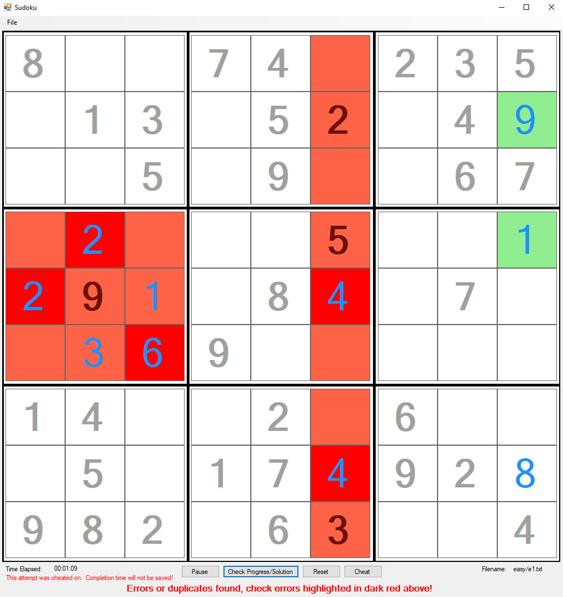

# Sudoku
Created a Sudoku game puzzle using WinForms for C#.NET with the ability to pull up an unsolved puzzle from varying difficulties, track progress, pause, save, load, cheat, verify, and reset the puzzle.

